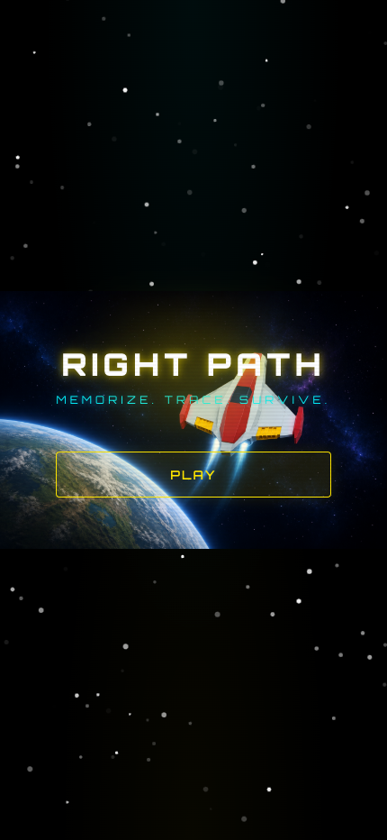
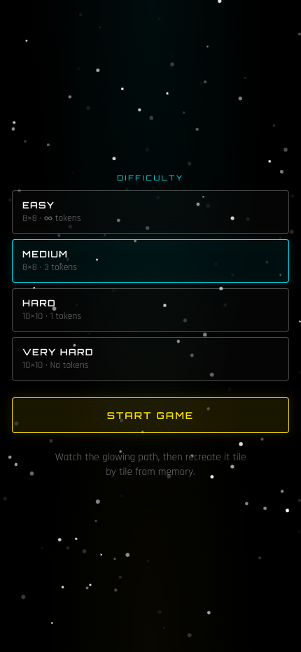
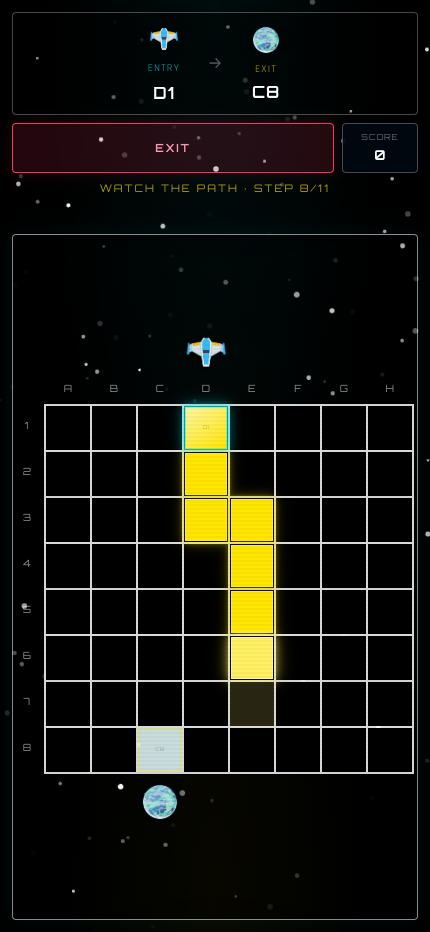
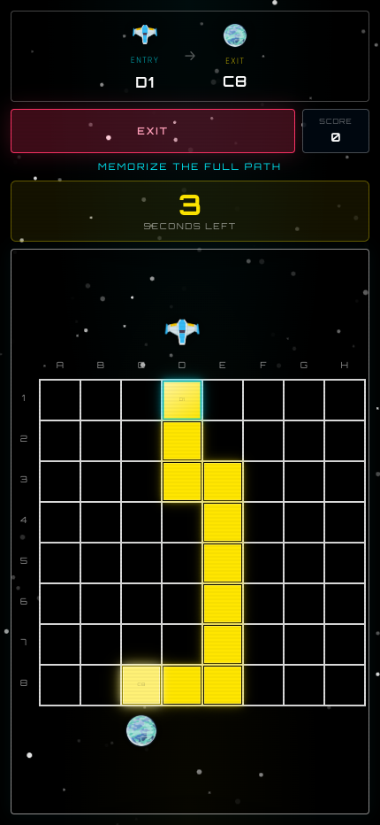
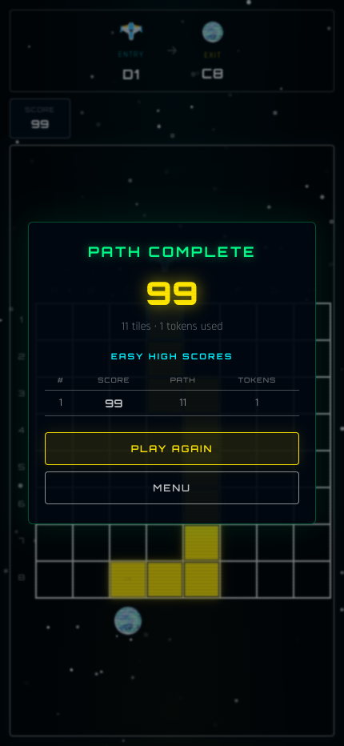

# Right Path

**Memorize. Trace. Survive.**

Right Path is a memory puzzle game with a retro-futuristic aesthetic. Watch a glowing path snake across a grid, memorize it, then recreate the route tile by tile — one wrong step ends the run.

## How to Play

1. **Tap Play** — open the difficulty picker from the splash screen.
2. **Choose a difficulty** — grid size, reveal time, token limits, and path complexity scale with each level.
3. **Watch the reveal** — the path animates from the entry tile (top row) to the exit tile (bottom row). A spaceship and planet mark the entry and exit columns on the board.
4. **Memorize** — after the full path is shown, you get a few seconds to commit it to memory.
5. **Trace blind** — tap tiles in the correct order without seeing the path ahead. Only tiles you have already traced stay highlighted.
6. **Use tokens wisely** — spend a token to replay the path (`Use Token (N)`). Each token reduces your per-tile score.
7. **Exit anytime** — leave a run mid-game with the red **Exit** button in the HUD toolbar.
8. **Win or lose** — complete the path for a high score, or hit a wrong tile for instant game over.

## Difficulty Levels

Difficulty is tuned for mobile-first play: easy and medium share an 8×8 grid, while hard and very hard use a 10×10 grid so tiles stay large enough to tap comfortably.

| Level | Grid | Reveal | Tokens | Path turns |
|-------|------|--------|--------|------------|
| Easy | 8×8 | 7.0s | ∞ | 1–3 |
| Medium | 8×8 | 3.5s | 3 | 3–6 |
| Hard | 10×10 | 2.5s | 1 | 6–12 |
| Very Hard | 10×10 | 1.5s | 0 | 10–15 |

Higher difficulties shorten the memorization window, limit tokens, and generate paths with more turns — without shrinking tile size on phone screens.

High scores are saved per difficulty in your browser's local storage.

## Scoring

- Points are awarded for each correct tile.
- Using tokens applies a penalty multiplier — fewer tokens means a higher score.
- Harder difficulties offer more base points per tile, but also steeper token penalties.

## Features

- **Animated starfield** background with a subtle scanline overlay
- **Difficulty-scaled paths** — turn count ranges per level for predictable challenge curves
- **Route markers** — ship and planet sit in dedicated grid rows above and below the board, aligned with entry/exit columns
- **Compact HUD** — entry/exit header, toolbar with token, exit, and score; reveal status only during path preview
- **Translucent result screens** — game over and victory modals with per-difficulty high-score tables

## Screenshots

### Splash Screen



### Difficulty Selection



### Path Reveal



### Gameplay



### Victory



## Getting Started

```bash
npm install
npm run dev
```

Open [http://localhost:5173](http://localhost:5173) in your browser.

### Other Scripts

```bash
npm run build    # Production build
npm run preview  # Preview production build
npm run lint     # Run ESLint
```

To regenerate README screenshots (requires a production preview server on port 4173):

```bash
npm run build
npm run preview
node scripts/capture-screenshots.mjs
```

## Tech Stack

- [React 19](https://react.dev/) + [TypeScript](https://www.typescriptlang.org/)
- [Vite](https://vite.dev/) for dev and build tooling
- [tsParticles](https://particles.js.org/) for the starfield background
- CSS custom properties for the neon terminal look
- Local storage for high-score persistence
